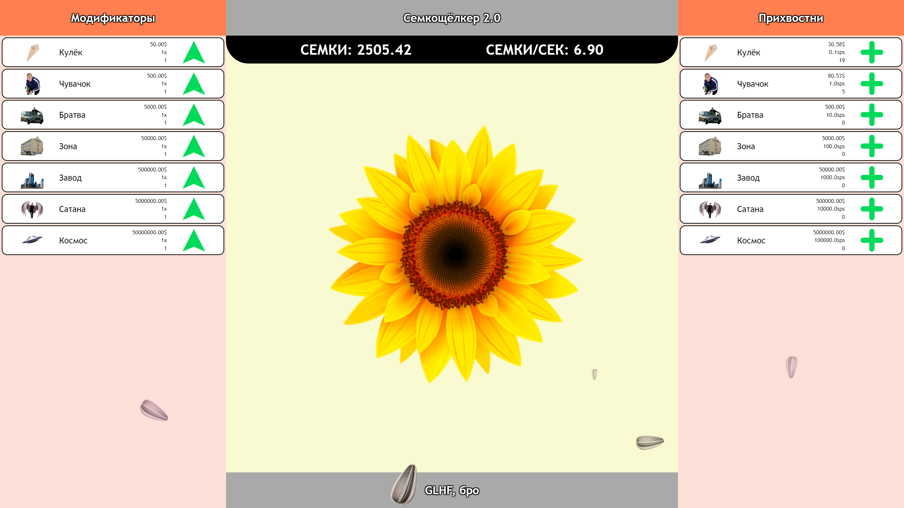
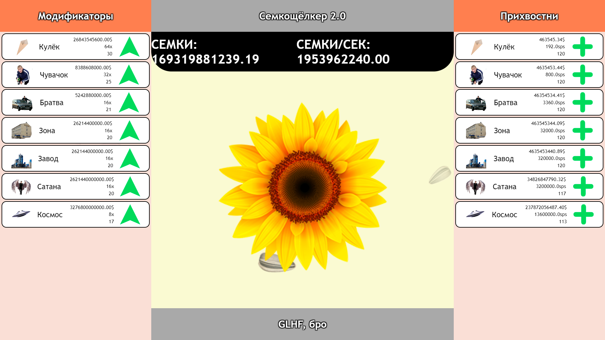

# SEMKICLICKER 2

The most notorious of all the clickers! Well, not actually... But its open-source, though.  

## Screenshots

  

  

## Contents

1. [Russian](#russian)
    1. [Описание](#описание)
    2. [Установка](#установка)
    2. [Текстурки](#текстурки)
    3. [Геймплей](#геймплей)
    4. [Недоработки](#недоработки)
2. [English](#english)  
    1. Description
    2. Installation
    3. Textures
    4. Gameplay
    5. Known flaws

# [Russian](#russian)

Это русское описание для игры. If your looking for an English one: [its here](#english) **WIP**.

1. [Описание](#описание)
2. [Установка](#установка)
2. [Текстурки](#текстурки)
3. [Геймплей](#геймплей)
4. [Недоработки](#недоработки)

## [Описание](#описание)

Простенькая игра о защёлкивании каждой семки во вселенной, сделанная менее, чем за день, без дополнительных библиотек и инструментов (даже шрифт поставляемый в операционной системой), и представляющая собой простую веб-страничку. Написан на HTML, CSS и чистом JavaScript. Самая игра является обычным кликер-айдлером с семечками в качестве валюты.  
Почему версия `2.0`? Ну, это долгая история... Да и, кстати, первая версия на самом деле называлась `ГопникКликер`... Но его больше не существует, так что RIP in pepperonis, `ГопникКликер` ;(.

## [Установка](#установка)

Установка не требуется никакая. Ну почти никакая: браузер иметь всё-таки придется. Просто в любом современном браузере открываете файл `src/index.html`, и можете играть наздоровье. Только, наверное, Internet Explorer такую *невероятно сложную* задачу не потянет, так что скачайте что-нибудь нормальное в конце концов.

## [Текстурки](#текстурки)

Короче, такое дело... Мне было лень рисовать собственные текстурки, а игру я менее чем за день сделал, и то - в шутку. В общем, взял я картинки из интернета, поэтому никакой лицензии на их использование у меня, естественно, нет. Обычно это никого в интернете не останавливает, но я бы не хотел нарушать чьи-то права, как и не хотелось бы, чтобы кто-то моё творение выдавал за своё. Да, лицензия здесь MIT, но не "Делай, что хочешь" WTFPL и не CC, так что соблюдать условия всё-таки нужно - они и так элементарны.  
Итак, чтобы игра не выглядела совсем пустой со сломанными картинками на странице, я вставил простые картинки с цифрами. Если что, просто можете использовать свои текстурки, закинув их в папку `res` под теми же именами, что текущие заглушки. 

## [Геймплей](#геймплей)

Если вы ни разу в жизни не встречались с кликером (хех, окей...), то задача проста:
- Кликаете на центральный кликер (цветок подсолнечника в оригинале или 'I' в публичной версии), чтобы заработать начальные семки
- Покупаете прихвостней
- Они приносят пассивный доход семок
- Покупаете прихвостней получше
- Улучшаете их модификаторами из левой панельки
- Получаете триллионы семок
- PROFIT!

Для всех кликер-математиков, вот подробности. sps - семки в секунду, это значение указывается для одного прихвостня, увеличивается модификатороми и множителями модификаторов. Множитель удваивается на каждый пятый модификатор. Цена прихвостня растет на 10% с каждой покупкой. Стоимость модификатора растет в два раза с каждой покупкой. Вроде бы это все переменные.

## [Недоработки](#недоработки)

Небольшой список различных багов или недоработок, о которых я знаю, но пока не было времени исправить.

1. Сохранения

Самая главная проблема с игрой - это отсутсвие возможности сохраняться... Знаю, знаю, но их пока в игре нет. Один раз живем, так сказать.

2. Вертикальная ориентация экрана

Не думаю, что эта игра будет хорошо работать на мобильных устройствах, которые обычно держат в вертикальном положении, а не горизонтальном. Да и вообще я мало тестировал на устройствах с меньшем разрешением экрана, так что могут быть некоторые неполадки, например, на ноутбуках.

3. Дизайн шестилетки

Спасибо за замечание, можно о дизайне не продолжать.

4. Оптимизация  

Не проверял, насколько требовательна к компьютеру эта игра, но вполне возможно из-за обновления игры на каждом кадре (60 раз в секунду на мониторе 60Гц) могут возникать подтормаживания.

5. Кликер  

На самом деле у игрока нет никакой возможности изменить количество семок за клик, поэтому эта игра ближе к жанру айдлер, а не кликер, однако, разработчики обычно эти два жанра не различают и запихивают в одну кучу, так что, пожалуй, здесь я пойду за остальным стадом и оставлю в названии "кликер".  
Тем не менее, иметь возможность апгрейда мощности клика было бы полезным. Также ещё можно бы было апгрейды роста стоимости прихвостней добавить, или просто чтобы их сделать дешевле.  

6. Достижения

В игре нет никакой конечной цели. Не думаю, что это вообще главная фича кликер-игр - не сказать, что бы они имели мощный сюжет :P... В общем, на данный момент нет даже ачивок, которые бы хотелось игроку открывать - некоторой награда от игры.

7. Реиграбельность

Тут даже сохранений нет, какая реиграбельность? XD. Тем не менее, системы "престижа" нет - вы до скончания веков будете с 1x множителем.

8. Читы

Только по секрету вам скажу... Античита здесь никакого нет, так что развлекайтесь, как хотите. Если просто хочется добавить семок, то достаточно в консоли ввести `semki_value += 150` или любое другое значение, на которое хотите увеличить. Можете также умножать в сто раз. Развлекайтесь, как хотите, игры для того и существуют ;).

# [English](#english)

**WIP**  
This is an English description for the game. If your looking for a Russian one: [its here](#russian).  
Although, even the game doesn't have English translation. So, i guess, this part of README won't be touched for awhile ;).
